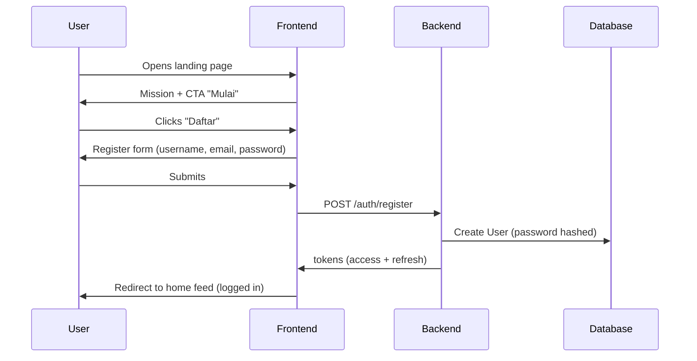
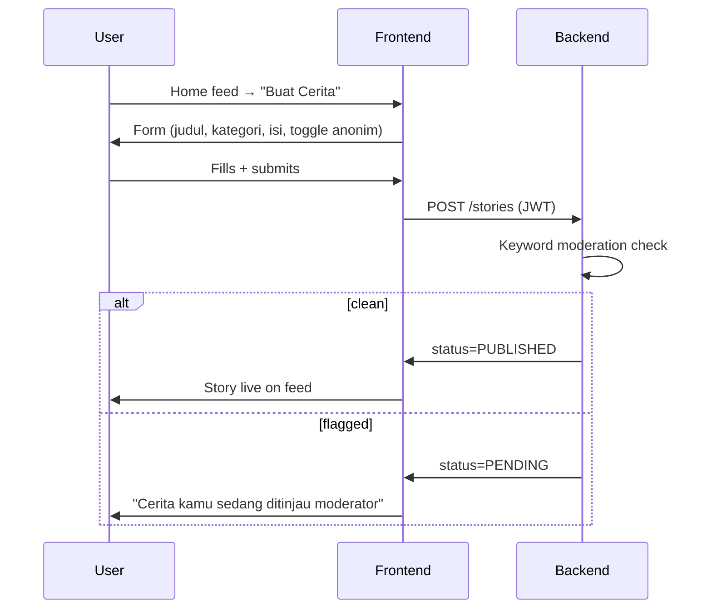
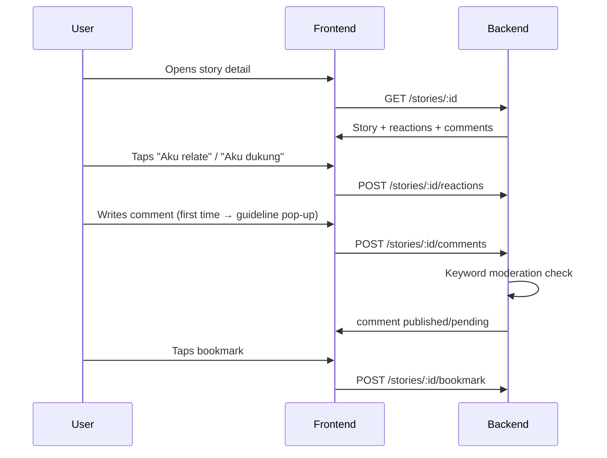
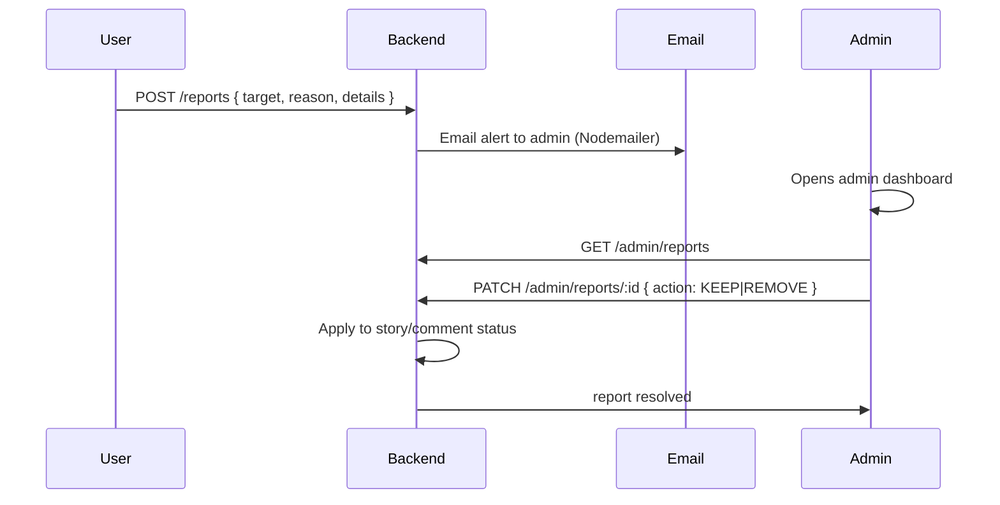

# CeritaKita — Product Requirements Document (PRD)

| | |
|---|---|
| **Product** | CeritaKita |
| **Version** | 1.0 (MVP) |
| **Status** | Approved for build |
| **Owner** | Product Team (Business Class — SDG 5) |
| **Date** | 18 August 2026 |
| **SDG Alignment** | **SDG 5 — Gender Equality** (Target 5.1, 5.5, and cross-cutting Target 16.10 on safe participation) |

---

## Table of contents

1. [Executive summary](#1-executive-summary)
2. [Problem & context](#2-problem--context)
3. [Goals & success metrics](#3-goals--success-metrics)
4. [Target users & personas](#4-target-users--personas)
5. [User journeys](#5-user-journeys)
6. [Feature specifications](#6-feature-specifications)
7. [Design system](#7-design-system)
8. [Content strategy & seed plan](#8-content-strategy--seed-plan)
9. [Non-functional requirements](#9-non-functional-requirements)
10. [Risk register](#10-risk-register)
11. [Out of scope & future roadmap](#11-out-of-scope--future-roadmap)
12. [Assumptions, dependencies & constraints](#12-assumptions-dependencies--constraints)

---

## 1. Executive summary

**CeritaKita** ("Our Stories") is a safe digital sharing platform that addresses a root problem behind gender inequality in Indonesia: **the belief among many men that they are inherently superior to women**, reinforced by social, economic, and cultural privileges. The platform gives anyone — especially women and marginalized groups who experience gender bias — a place to:

1. **Share experiences** of discrimination, superiority, or gender bias, optionally **anonymously**.
2. **Read others' stories** to build empathy across genders.
3. **Give and receive support** through non-aggressive reactions and moderated comments.
4. **Learn** through a short-form education hub.

The product's bet: *empathy, not argument, is the most effective tool against superiority bias*. By making personal stories visible and safe to share, CeritaKita helps men see the lived experience behind the statistics, and helps women feel heard.

**MVP scope** is a responsive web app (mobile-first) with authentication, story publishing, a categorized feed, reactions, comments, bookmarks, an education hub, a content-moderation pipeline, and an admin dashboard with analytics.

---

## 2. Problem & context

### 2.1 Problem statement

> "Laki-laki merasa lebih superior dari perempuan." — *Men feel more superior to women.*

### 2.2 Root-cause analysis

The feeling of superiority is not a single belief but a cluster of reinforcing factors:

| Root cause | How it manifests | How CeritaKita responds |
|---|---|---|
| **Privilege normalization** — men hold disproportionate access to leadership, income, and public voice | Women's achievements are dismissed; men assume default authority | Stories + education make privilege visible and nameable |
| **Silenced experiences** — women rarely have a safe channel to speak up without fear of retaliation | Harassment, bias, and microaggressions go unreported | Anonymous publishing removes the fear of retaliation |
| **Empathy gap** — men rarely hear firsthand accounts of what women face | "It's not that bad" / "you're overreacting" | Reading real stories builds emotional understanding |
| **No low-barrier education** — gender equality content is often academic and inaccessible | Misinformation and stereotypes persist | Short, plain-language education hub |
| **Unsafe discussion spaces** — general social media rewards outrage | Discussions escalate, victims get attacked | Guided community norms + automated + human moderation |

### 2.3 Why a "sharing platform"?

Chosen over alternatives (petition, campaign site, chatbot, reporting app) because:

- **Narrative is persuasive.** Statistics inform; stories change minds. A personal account of bias is more likely to reduce a man's superiority belief than an infographic.
- **Bidirectional.** Both women (share/vent/heal) and men (read/reflect/learn) are served — it is not a one-way lecture.
- **Community builds momentum.** Support reactions and moderated comments create a norm of respect.
- **Low technical complexity, high impact.** A CRUD + moderation app is achievable in the available timeframe.

### 2.4 Success criteria (what "working" looks like)

- A woman can publish a story anonymously in under 2 minutes and feel safe doing so.
- A man can read a story, understand a perspective he had not considered, and respond supportively.
- Abusive content is blocked before publication or removed quickly.
- Moderators have a clear, low-effort workflow to keep the space safe.

---

## 3. Goals & success metrics

### 3.1 Product goals

| ID | Goal | Type |
|---|---|---|
| G1 | Provide a safe space to share gender-bias experiences (with anonymous option) | User |
| G2 | Foster cross-gender empathy through reading and supportive interaction | Impact |
| G3 | Deliver accessible gender-equality education | User |
| G4 | Keep the space safe via automated + human moderation | Trust & Safety |
| G5 | Give moderators an efficient toolset to review reports and content | Operations |

### 3.2 Success metrics (MVP)

| Metric | Definition | Target (post-launch demo) |
|---|---|---|
| Registered users | Count of `User` rows | 50+ |
| Stories published | Count of `Story` with status `PUBLISHED` | 30+ |
| Anonymous usage rate | Anonymous stories ÷ total stories | ≥ 40% |
| Support reactions per story | Avg `Reaction` count per published story | ≥ 3 |
| Comment guideline acceptance | Users who dismiss the guideline pop-up and still comment politely | qualitative |
| Moderation block rate | Content flagged by keyword filter ÷ total submitted | > 0% (filter is active) |
| Report resolution time | Time from report → admin decision | < 24h |
| Education engagement | Article reads | 20+ reads |

*Note: these are demo-scope targets for a business-class prototype, not production KPIs. Retention (D7/D30) is defined in §11 as out of MVP scope.*

---

## 4. Target users & personas

**Primary market:** General public in Indonesia (all genders, ages ~16–45), who access the web via mobile.

### 4.1 Persona 1 — "Sari" (the sharer)

> **Demographics:** 24, female, junior office worker, Jakarta.
> **Archetype:** Has experienced workplace bias; wants to be heard; fears professional retaliation.

- **Goals:** Share her story safely; feel validated; not lose her job over speaking up.
- **Pain points:** Worried her boss/colleagues will recognize her; general social media feels toxic; doesn't know how to put it into words.
- **Motivation to use:** The anonymous toggle. The supportive (not argumentative) reaction options.
- **Behavior on the app:** Uses anonymous mode; writes a story about workplace bias; checks reactions; bookmarks the "tips for responding to bias" article.
- **Quote:** *"I want to speak, but I'm scared of being identified."*

### 4.2 Persona 2 — "Bima" (the skeptic-turned-ally)

> **Demographics:** 27, male, engineering manager, Bandung.
> **Archetype:** Holds mild superiority assumptions ("men are just more logical"); not hostile, just unexposed.

- **Goals:** (initial) find reasons to validate his views; (later) understand "what women actually complain about."
- **Pain points:** Doesn't trust feminist content online; finds academic writing boring; defensive when lectured.
- **Motivation to use:** Curiosity after a friend shared a story link (social sharing feature).
- **Behavior on the app:** Reads 3–4 stories from the workplace category; notices the pattern; reads an education article; leaves a neutral/supportive comment; does **not** post (at first).
- **Quote:** *"Fine, let me see what this is about."*

### 4.3 Persona 3 — "Ibu Ratna" (the community moderator)

> **Demographics:** 38, female, teacher & community volunteer, Yogyakarta.
> **Archetype:** Trusted adult; wants the space safe for students she recommends it to.

- **Goals:** Quickly remove harmful content; understand whether the platform is safe to recommend.
- **Pain points:** Limited time; wants a clean queue, not endless scrolling.
- **Motivation to use:** Appointed as admin; believes in the mission.
- **Behavior on the app:** Opens admin dashboard daily; reviews pending reports; approves/removes; checks the analytics summary.
- **Quote:** *"Show me what needs my attention."*

### 4.4 Persona 4 — "Dito" (the low-empathy risk user)

> **Demographics:** 21, male, university student, Surabaya.
> **Archetype:** May post dismissive or superiority-flavored comments; the reason moderation exists.

- **Goals:** Provoke or "win" arguments.
- **Pain points:** Feels attacked when corrected.
- **Motivation to use:** Anonymous access lowers his barrier to posting.
- **Behavior on the app:** Posts a comment like "perempuan itu emosional"; the keyword filter or a report catches it; admin issues a warning or removes the content.
- **Quote:** *"Why can't I say what everyone's thinking?"*
- **Design implication:** Anonymous mode must still be traceable to a real account internally (moderation requirement).

### 4.5 Empathy map (Sari — the primary persona)

```
┌──────────────────────────────────────────────────────────┐
│ THINKS & FEELS                                          │
│  "Am I being dramatic?" "Will I get fired?"             │
│  "I just want someone to say 'I believe you'."          │
├──────────────────────────────────────────────────────────┤
│ SEES      │ HEARS               │ SAYS & DOES            │
│  all-male │  "you're too        │  writes & rewrites     │
│  meeting  │   emotional"        │  her story             │
│  rooms    │  "it's just a joke" │  toggles ANONYM        │
│           │                     │  reads similar stories │
├──────────────────────────────────────────────────────────┤
│ PAINS                             │ GAINS                 │
│  fear of retaliation               │  being heard          │
│  no safe channel                   │  community support    │
│  feeling alone                     │  language to name bias│
└──────────────────────────────────────────────────────────┘
```

---

## 5. User journeys

### 5.1 Onboarding & authentication



> **Forgot password branch:** Login → "Lupa password?" → enter email → `POST /auth/forgot-password` → OTP emailed → `POST /auth/verify-otp` → `POST /auth/reset-password`.

> **Hard rule:** There is **no** anonymous browsing. The flowchart's "lanjut sebagai anonim" is reinterpreted per the product owner's decision: **the user must register/login first**; anonymity applies only to how their *published stories* are displayed.

### 5.2 Write a story



### 5.3 Read, react, comment, bookmark



### 5.4 Education hub

```
Home feed → "Hub Edukasi" → list of articles → tap article → read → (share / back)
```

### 5.5 Report & moderation (admin)



---

## 6. Feature specifications

Feature IDs (`FR-*`) are stable references used across the backlog, architecture, and prompts.

### 6.1 Authentication & accounts

| ID | Feature | Priority |
|---|---|---|
| FR-AUTH-01 | Register (username, email, password) | Must |
| FR-AUTH-02 | Login (email + password) | Must |
| FR-AUTH-03 | Forgot password via emailed OTP | Must |
| FR-AUTH-04 | Session persistence (JWT access + refresh) | Must |
| FR-AUTH-05 | Logout | Must |
| FR-AUTH-06 | Anonymous publishing mode (per-story) | Must |

#### FR-AUTH-01 — Register

- **Description:** Create an account with **username**, **email**, and **password** only (no name, no phone).
- **Acceptance criteria:**
  - Given the register form is shown, when the user enters a valid unique username/email and a password ≥ 8 chars, then the account is created and the user is logged in.
  - Given a duplicate username or email, then an inline error is shown ("Username sudah digunakan" / "Email sudah terdaftar").
  - Given an invalid email or password < 8 chars, then validation errors are shown before submission.
- **Edge cases:** whitespace-trimmed inputs; email lowercased on submit; username must be `^[a-zA-Z0-9_]{3,20}$`.
- **Error states:** network failure → toast "Terjadi kesalahan, coba lagi"; server 409 → field-level message.

#### FR-AUTH-03 — Forgot password (OTP)

- **Description:** User requests reset, receives a **6-digit OTP** via email (Nodemailer SMTP), verifies it, then sets a new password.
- **Acceptance criteria:**
  - Given a registered email, when "Lupa password?" is submitted, then an OTP is emailed and a verify screen is shown.
  - Given an unregistered email, then the app shows a **generic** success message (do not reveal whether the email exists — security).
  - Given a correct OTP (within 10 min / 3 attempts), then the user may set a new password.
  - Given an expired/wrong OTP, then an error is shown and the user may resend.
- **Edge cases:** OTP expires after 10 minutes; resend cooldown 60s; OTP invalidated after use.
- **Security:** OTP stored hashed; purpose-limited (`PASSWORD_RESET`).

### 6.2 Feed & discovery

| ID | Feature | Priority |
|---|---|---|
| FR-FEED-01 | Home feed (list of stories) | Must |
| FR-FEED-02 | Category filter | Must |
| FR-FEED-03 | Search by keyword | Should |
| FR-FEED-04 | Trending stories | Should |
| FR-FEED-05 | Sort (newest / trending / most supportive) | Should |

#### FR-FEED-01 — Home feed

- **Description:** A paginated list of published stories showing: display name (or "Anonim #123"), category badge, title, content preview, reaction counts, comment count, relative time.
- **Acceptance criteria:**
  - Given a logged-in user, then the feed shows only stories with `status=PUBLISHED`, newest first.
  - Given a long content, then a preview of ~160 chars is shown with "Baca selengkapnya".
  - Given an anonymous story, then the author is shown as "Anonim #<id>" and never the real username.
  - Given empty result set, then an empty state ("Belum ada cerita di kategori ini — jadi yang pertama!") is shown.

### 6.3 Story lifecycle

| ID | Feature | Priority |
|---|---|---|
| FR-STORY-01 | Create story | Must |
| FR-STORY-02 | Story detail view | Must |
| FR-STORY-03 | Edit / delete own story | Should |
| FR-STORY-04 | Reactions ("Aku relate" / "Aku dukung") | Must |
| FR-STORY-05 | Comments (with community guideline) | Must |
| FR-STORY-06 | Bookmark / save | Should |
| FR-STORY-07 | Social sharing (WA / Twitter) | Should |

#### FR-STORY-01 — Create story

- **Description:** Form with **judul**, **kategori** (dropdown of 6), **isi**, and an **anonymous toggle**.
- **Categories:** `Lingkungan Kerja`, `Pendidikan`, `Rumah Tangga`, `Ruang Publik`, `Media Sosial`, `Lainnya`.
- **Acceptance criteria:**
  - Given valid inputs, then the story is created and passed through moderation (see FR-MOD-01).
  - Given the anonymous toggle is ON, then the story is stored with `isAnonymous=true` and displayed as "Anonim #<id>".
  - Given an empty title or content, then validation errors are shown.
  - Given a logged-out user (no token), then the create button redirects to login.
- **Edge cases:** content length 1–5000 chars; title 3–120 chars.

#### FR-STORY-04 — Reactions

- **Description:** Two non-aggressive reactions: **"Aku relate"** (I relate) and **"Aku dukung"** (I support). One reaction per user per story.
- **Acceptance criteria:**
  - Given a user taps a reaction, then the count increments and the button toggles to active.
  - Given the user taps again, then the reaction is removed (toggle).
  - Given the user switches reaction type, then the previous is replaced.
  - A user cannot react with both types on the same story.

#### FR-STORY-05 — Comments

- **Description:** Text comments under a story. First-time commenters see a **community guideline pop-up** ("Gunakan bahasa yang sopan dan saling menghargai").
- **Acceptance criteria:**
  - Given a user posts a comment, then it is run through moderation (FR-MOD-01) and shown/pending accordingly.
  - Given a user's first comment, then the guideline pop-up appears once; afterwards the comment form is shown.
  - Comments are listed newest-first with display name/anon and time.

#### FR-STORY-07 — Social sharing

- **Description:** "Bagikan" button produces a shareable link + native share intent.
- **Acceptance criteria:**
  - Given a story, then a copyable link (`/s/:id`) and a **WhatsApp** / **Twitter** share URL are available.
  - Given a shared link is opened while logged out, then the user is redirected to login, then back to the story.

### 6.4 Education hub

| ID | Feature | Priority |
|---|---|---|
| FR-EDU-01 | Education hub (article list) | Must |
| FR-EDU-02 | Article detail | Must |

- **Acceptance criteria:**
  - Hub lists articles with cover image, title, summary.
  - Article detail renders title, body (markdown), and share button.
  - Articles are curated by the team (static content seeded; admin may add later — out of MVP scope).

### 6.5 Profile

| ID | Feature | Priority |
|---|---|---|
| FR-PROF-01 | Profile page | Must |
| FR-PROF-02 | My stories (including anonymous ones, visible only to self) | Should |
| FR-PROF-03 | Saved / bookmarked stories | Should |
| FR-PROF-04 | Account settings (change password, edit profile) | Should |

- **Acceptance criteria:**
  - Profile shows username, join date, counts (stories, bookmarks).
  - "Cerita Saya" lists the user's own stories including anonymous ones (flagged "Anonim" only for self).
  - "Tersimpan" lists bookmarked stories.
  - Settings allow username change and password change.

### 6.6 Moderation & trust & safety

| ID | Feature | Priority |
|---|---|---|
| FR-MOD-01 | Automated keyword filter | Must |
| FR-MOD-02 | Report content (story/comment) | Must |
| FR-MOD-03 | Report email alert to admin | Should |

#### FR-MOD-01 — Keyword filter

- **Description:** Before publishing a story or comment, the backend checks against a **banned-word list** (profanity, hate speech, SARA terms, sensitive personal data patterns).
- **Acceptance criteria:**
  - Given content matches a banned word, then `status=PENDING` and the content enters the admin review queue.
  - Given clean content, then `status=PUBLISHED`.
  - Banned-word list is stored in the DB (`BannedWord`) and can be extended by admin (see FR-ADMIN-05).

#### FR-MOD-02 — Report content

- **Description:** Any user can report a story or comment via a modal (reason + optional details).
- **Reasons:** `Konten kasar`, `Ujaran kebencian`, `SARA`, `Membocorkan data pribadi`, `Lainnya`.
- **Acceptance criteria:**
  - Given a report is submitted, then a `Report` row is created with status `PENDING` and an email alert is sent to admin (FR-MOD-03).

### 6.7 Admin dashboard

| ID | Feature | Priority |
|---|---|---|
| FR-ADMIN-01 | Report queue | Must |
| FR-ADMIN-02 | Content moderation actions (keep/remove) | Must |
| FR-ADMIN-03 | Content status management (pending/published/removed) | Must |
| FR-ADMIN-04 | Analytics summary | Should |
| FR-ADMIN-05 | Banned-word management | Should |

- **Acceptance criteria:**
  - Admin can see all pending reports, view the offending content, and choose **keep** (resolves report) or **remove** (sets content `status=REMOVED`).
  - Admin can review `PENDING` content from the keyword filter and publish/remove.
  - Analytics shows: total users, stories by category, reactions, reports resolved, content removed.
  - Role-based access: only `role=ADMIN` can access admin endpoints (guard).

---

## 7. Design system

**Guiding principle:** *safe, warm, and supportive.* Avoid harsh reds/aggressive visuals; prefer calm teals and warm neutrals. Copy must be empathetic and non-confrontational.

### 7.1 Brand

- **Name:** CeritaKita
- **Tagline:** "Ceritamu didengar." (*Your story is heard.*)
- **Personality:** empathetic, calm, inclusive, trustworthy.

### 7.2 Color palette

| Token | Hex | Usage |
|---|---|---|
| `primary` | `#2F9E8E` | Primary buttons, links, active states (calm teal) |
| `primary-dark` | `#1E6F63` | Hover/pressed primary |
| `primary-light` | `#E0F2EF` | Selected chips, tinted backgrounds |
| `accent-relate` | `#8B7FC7` | "Aku relate" reaction (soft violet) |
| `accent-support` | `#E88B6B` | "Aku dukung" reaction (warm coral) |
| `background` | `#FBF9F7` | Page background (warm off-white) |
| `surface` | `#FFFFFF` | Cards, forms |
| `text-primary` | `#2D2A2E` | Headings, body |
| `text-secondary` | `#6B676E` | Captions, meta, timestamps |
| `border` | `#E6E1DC` | Dividers, input borders |
| `danger` | `#C0463D` | Errors, destructive actions (sparingly) |
| `success` | `#3D8B5E` | Success toasts |
| `warning` | `#D9932F` | Pending/review states |

### 7.3 Typography

- **Headings:** `Poppins` (600/700) — friendly, rounded.
- **Body:** `Nunito Sans` (400/500/700) — readable, warm.
- **Scale (mobile-first):** H1 28/36, H2 22/30, H3 18/26, Body 16/24, Caption 13/18.

### 7.4 Spacing & layout

- 8pt grid. Page max-width 720px (story-first reading layout), feed max-width 960px.
- Cards: 16px radius, 1px border, 8px shadow on hover.

### 7.5 Components

- **Buttons:** primary (filled teal), secondary (outlined), ghost. Height 44px.
- **Inputs:** rounded 10px, focus ring in `primary`.
- **Category chips:** pill, default outline, selected = `primary-light` + `primary` text.
- **Reaction buttons:** pill with emoji + label + count; active state fills with accent color.
- **Badges:** `Anonim` (violet), `PENDING` (warning), `REMOVED` (danger), category (neutral).
- **Modals:** centered, 16px radius, overlay 40% black; used for guideline pop-up and report form.
- **Toasts:** bottom-center, auto-dismiss 4s.

### 7.6 Tone-of-voice & key copy (EN → ID)

| Context | English | Bahasa Indonesia (in-app) |
|---|---|---|
| CTA start | Start | "Mulai" |
| Register | Create account | "Daftar" |
| Login | Sign in | "Masuk" |
| Anonymous toggle | Post anonymously | "Tampilkan sebagai anonim" |
| Anonymous display | Anonymous #123 | "Anonim #123" |
| Reaction 1 | I relate | "Aku relate" |
| Reaction 2 | I support | "Aku dukung" |
| Guideline pop-up | Please be kind | "Gunakan bahasa yang sopan dan saling menghargai." |
| Report | Report | "Laporkan" |
| Pending notice | Under review | "Cerita kamu sedang ditinjau moderator." |
| Empty feed | No stories yet | "Belum ada cerita di kategori ini — jadi yang pertama!" |
| Forgot password | Forgot password? | "Lupa password?" |

### 7.7 Accessibility

- Contrast ratio ≥ 4.5:1 for body text.
- All interactive elements have focus states and `aria-label`s.
- Semantic HTML (landmarks, `label` for inputs, `alt` for images).
- Color is never the sole signal (reactions include text labels).

---

## 8. Content strategy & seed plan

### 8.1 Content pillars

1. **Lived experience** (user stories) — the core loop.
2. **Education** — short articles on gender equality, statistics, and how to respond to bias.
3. **Community norms** — guidelines that model respectful language.

### 8.2 Seed stories (15, covering all 6 categories)

| # | Category | Title (ID) | Tone |
|---|---|---|---|
| 1 | Lingkungan Kerja | "Aku diminta jadi notulen terus, padahal jabatan sama" | relatable |
| 2 | Lingkungan Kerja | "Bos bilang ideku bagus, tapi di-claim rekan pria" | frustration → relief |
| 3 | Lingkungan Kerja | "Gaji kami ternyata beda untuk posisi yang sama" | factual |
| 4 | Pendidikan | "Di kelas, pendapat pria selalu didahulukan" | observation |
| 5 | Pendidikan | "Dosen bilang 'perempuan nggak perlu sekolah tinggi'" | hurt → resilience |
| 6 | Rumah Tangga | "Aku lelah ditanya kapan nikah, kapan punya anak" | vent |
| 7 | Rumah Tangga | "Suamiku mulai paham setelah aku jelaskan beban mental" | hopeful |
| 8 | Ruang Publik | "Dicatcall di jalan, dan orang-orang tertawa" | painful |
| 9 | Ruang Publik | "Di angkutan umum, aku harus duduk dengan tas di pangkuan" | everyday bias |
| 10 | Media Sosial | "Komentar 'mending di dapur' di postinganku" | frustration |
| 11 | Media Sosial | "Aku lelah lihat meme yang merendahkan perempuan" | exhaustion |
| 12 | Lainnya | "Ayah dulu bilang aku nggak bisa jadi pemimpin" | reflection |
| 13 | Lainnya | "Sekarang aku jadi manajer, dan aku bangga" | triumph |
| 14 | Lainnya | "Cerita dari sisi pria: aku diajari jangan nangis" | ally / empathy |
| 15 | Lainnya | "Ibuku yang mengajarkan kesetaraan padaku" | gratitude |

### 8.3 Education articles (6)

| # | Title (ID) | Summary |
|---|---|---|
| 1 | "Apa itu Kesetaraan Gender?" | Intro, myths vs facts |
| 2 | "Angka di Balik Kesenjangan" | Indonesia-relevant statistics (participation, wage gap, leadership) |
| 3 | "Apa Itu Mikroagresi & Kenapa Menyakitkan?" | Microaggressions explained |
| 4 | "5 Cara Merespons Bias Tanpa Konflik" | Practical scripts |
| 5 | "Menjadi Sekutu (Ally) Bagi Perempuan" | For male readers |
| 6 | "Panduan Komunitas CeritaKita" | Community norms in detail |

### 8.4 Banned-word seed (structure)

Seed the `BannedWord` table with a starter list of Indonesian profanity, hate-speech terms, and SARA slurs. Exact list maintained by the moderation team (not fully enumerated in public docs; see `04-Architecture.md` for the matching algorithm).

### 8.5 Demo accounts

| Role | Email | Password |
|---|---|---|
| Admin | `admin@ceritakita.id` | `admin123` |
| User | `sari@ceritakita.id` | `password123` |
| User | `bima@ceritakita.id` | `password123` |

---

## 9. Non-functional requirements

| Category | Requirement |
|---|---|
| Performance | First contentful paint < 2s on 4G; API p95 < 300ms for feed/story endpoints |
| Security | Passwords hashed (bcrypt/argon2); OTP hashed + expiring; JWTs signed & expiring; role guards on admin routes; input validation (class-validator); CORS restricted to frontend origin |
| Privacy | Anonymous stories never expose the real author publicly; PII never in URLs/logs |
| Reliability | Graceful error handling; no 5xx leaking stack traces |
| Accessibility | WCAG 2.1 AA on core flows (contrast, keyboard, labels) |
| Responsiveness | Mobile-first; works 360px → 1280px |
| Compliance | Respect Indonesia's UU PDP (personal data protection) spirit: minimal data collection, consent to community norms |

---

## 10. Risk register

| ID | Risk | Likelihood | Impact | Mitigation |
|---|---|---|---|---|
| R1 | Anonymity abused to attack others | High | High | Every anonymous story tied to a real account internally; moderation pipeline |
| R2 | Keyword filter misses nuance (false negatives) | Med | Med | Human report + admin queue as second layer |
| R3 | Filter too aggressive (false positives) | Med | Med | `PENDING` (not auto-remove) → human review before removal |
| R4 | Low engagement / empty feed | Med | High | Seed 15 stories + 6 articles; demo accounts |
| R5 | Trolls / brigading | Med | Med | One reaction per user; comment moderation; rate limiting |
| R6 | OTP email not delivered (SMTP misconfig) | Med | Med | Mailtrap in dev; log fallback; resend button |
| R7 | Scope creep delays demo | High | High | MoSCoW priorities; out-of-scope list §11 |
| R8 | Token/security misconfiguration | Low | High | Guards + validation documented; refresh token rotation |

---

## 11. Out of scope & future roadmap

**Out of scope for MVP:**
- Native mobile apps
- AI/ML content moderation (keyword filter is MVP)
- Notifications inbox / push
- Follow/unfollow & social graph
- Direct messaging
- Gamification / badges
- Multilingual content (Bahasa Indonesia only for MVP)
- Admin ability to create/edit education articles (seeded statically)

**Future roadmap (post-MVP):**
1. AI-assisted moderation (sentiment/toxicity scoring)
2. Notifications (reply to my story/comment)
3. Rich media in stories (images)
4. Community-badges & verified storytellers
5. Anonymous-to-ally "reflection" prompts for readers
6. Partnerships with gender-equality NGOs

---

## 12. Assumptions, dependencies & constraints

**Assumptions:**
- Users have access to a mobile browser and email.
- Bahasa Indonesia UI is sufficient for the target market.
- A relational DB (PostgreSQL) is appropriate.

**Dependencies:**
- Docker available in the dev/build environment.
- SMTP credentials (Mailtrap or equivalent) for OTP emails.
- Node.js ≥ 20 runtime.

**Constraints:**
- Must ship as a demo-ready prototype quickly (ASAP timeline).
- Business-class scope: code + documentation deliverable for SDG 5 assessment.
- No budget for paid services in MVP (Mailtrap free tier acceptable).
